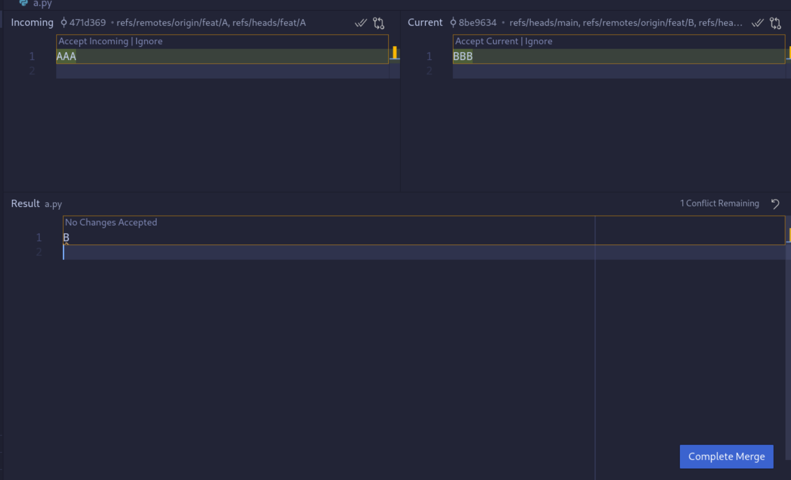

# Practical Exercises

## Cloning a Repository and Making Changes
In this section, we’ll learn how to **clone a repository**, make a small change, and **push** that change back to GitHub.

### Step 1: Clone this Repository
To clone this repository, follow these steps:

1. Go to [GitHub's Git Tutorial repository](https://github.com/pedro-curto/Git-Workshop)
   - Copy the URL by clicking on the **Code** button and copying the SSH link (`git@github.com:pedro-curto/Git-Workshop.git`)

2. **Clone the Repository**:
   - In Git Bash, navigate to the folder where you want to clone the repository. Use the `cd` command, for example:
     ```sh
     cd /c/Users/YourName/Documents/
     ```
   - Run the `git clone` command:
     ```sh
     git clone git@github.com:pedro-curto/Git-Workshop.git
     ```
   - After cloning, navigate into the project folder:
     ```sh
     cd Git-Workshop
     ```

### Step 2: Make Changes to the Cloned Repository

1. **Create your own branch**:
    - Create a new branch to work on your changes:
      ```sh
      git checkout -b feature/<your-name>
      ```
   - For example, for me:
     ```sh
     git checkout -b feature/pedrocurto
     ```
    - This command creates a new branch called `feature/<your-name>` and switches to it.
    - This isn't a good naming convention, but it's fine for this exercise.


1. **Create a New File**:
   - Inside the `Git-Workshop` folder, create a new file called `hello-git_<your-name>.txt`:
     ```sh
     touch hello-git_<your-name>.txt
     ```
   - You can also create the file using a text editor like **VSCode**. You can use Git Bash inside VSCode, which is what I would use if I used Windows

   - Add some content to the file, for example:
     ```
     This was created by <your-name>.
     ```

2. **Stage the File**:
   - Add `hello-git_<your-name>.txt` to the staging area:
     ```sh
     git add hello-git_<your-name>.txt
     ```
   - Run `git status` to confirm that the file is staged.

### Step 3: Commit and Push Changes
1. **Commit the Changes**:
   - Commit the staged changes with a message:
     ```sh
     git commit -m "feat: add hello-git_<your-name>.txt"
     ```

2. **Push Changes to GitHub**:
   - Push your changes to the GitHub repository:
     ```sh
     git push
     ```

---

## Part 2: Creating Your Own Repository and Making a Change

In this section, we will create our own Git repository, add some files, and **push it** to GitHub.

### Step 1: Create a New Repository on GitHub
1. **Go to GitHub**:
   - Log in to your GitHub account and click on the **+** icon at the top right corner, then click **New repository**.

2. **Set Up the Repository**:
   - Fill in the **Repository name** (e.g., `Tutorial-Repo`).
   - Set it to **Public** or **Private** (doesn't matter for this exercise).
   - **DO NOT** initialize it with a README file for this example.
   - Click **Create repository**.

### Step 2: Set Up Your Local Repository
1. **Open Git Bash**:
   - Create a folder where you want to keep your project and navigate to it:
     ```sh
     mkdir Tutorial-Repo
     cd Tutorial-Repo
     ```

2. **Initialize Git**:
   - Initialize Git in your folder:
     ```sh
     git init
     ```
   - This will create an empty Git repository locally.

### Step 3: Connect Your Local Repository to GitHub
1. **Add the Remote URL**:
   - Add your newly created GitHub repository as the remote (should be similar to the following):
     ```sh
     git remote add origin git@github.com:username/Tutorial-Repo.git
     ```
   - Replace `username` with your GitHub username.
   - If you don't understand what a remote is, it's just a way to link your local repository to a remote repository (like GitHub).
      - Ask for clarification if you need!

### Step 4: Create a File, Commit, and Push
1. **Create a New File**:
   - Create a new file called `README.md`:
     ```sh
     touch README.md
     ```
   - Add some content to it, for example:
     ```
     # My First Repository
     Hello World for GitHub!
     ```

2. **Stage the File**:
   - Add the file to the staging area:
     ```sh
     git add README.md
     ```

3. **Commit the Changes**:
   - Commit the changes with a descriptive message:
     ```sh
     git commit -m "docs: add README.md"
     ```

4. **Push the Changes to GitHub**:
   - Push your changes to the remote repository on GitHub:
     ```sh
     git push -u origin main
     ```
   - The `-u` flag sets up tracking -- future pushes can be done with a simple `git push`

5. See if the changes were **successful**:
   ```sh
   git log
   ```
   - You should see the commit history, including the commit you just made.

- Questions?

## Last Part: Fixing a Merge Conflict
- Going back to the Git Tutorial repository we cloned earlier, we will simulate a merge conflict and resolve it. To do so, we will have two volunteers make changes to the same file (`a.py`) and try to push them back to the repository. These are the instructions for the volunteers:

1. **Checkout to the branch that you previously created for yourself (`feature/<your-name>`)**:
   ```sh
   git checkout feature/<your-name>
   ```

2. **Edit the a.py file's print statement in line 7**:
   - Change the print statement to print the factorial of something else.
   - For example, Volunteer 1:
     ```python
     print(factorial(10))
     ```
   - And Volunteer 2:
     ```python
     print(factorial(20))
     ```

3. **Stage, commit, and push the changes**:
   - Stage the changes:
     ```sh
     git add a.py
     ```
   - Commit the changes:
     ```sh
     git commit -m "feat: updated factorial value in a.py"
     ```
   - Push the changes:
     ```sh
     git push
     ```

4. **Merge the changes back to the main branch**:
  **Volunteer 1** goes first:
  ```sh
  git checkout main 
  ```
  
  ```sh
  git merge feature/<your-name>
  ```

  - He will succeed, as he is the first to push the changes.

  **Volunteer 2** goes next:
  ```sh
  git checkout main
  ```

  ```sh
  git merge feature/<your-name>
  ```

  - The output that you will get will resemble this:
  ```
  Auto-merging a.py
  CONFLICT (content): Merge conflict in a.py
  Automatic merge failed; fix conflicts and then commit the result.
  ```

  - This means that there is a **merge conflict** in the `a.py` file. We need to manually open it, and fix the conflict:
  

  - We need to decide if we accept the left changes (Volunteer 1's changes) or the right changes (Volunteer 2's changes), or a mix of both.

  - When we finally decide, we simply commit:
  ```sh
  git commit -m "solved merge conflict"
  ```

  - And we push:
  ```sh
  git push
  ```

  - The commit history will now reflect both commits from the merges, and the commit that solved the merge conflict itself. It's solved!